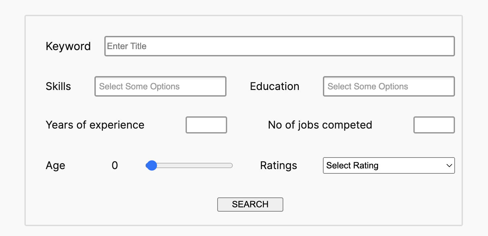
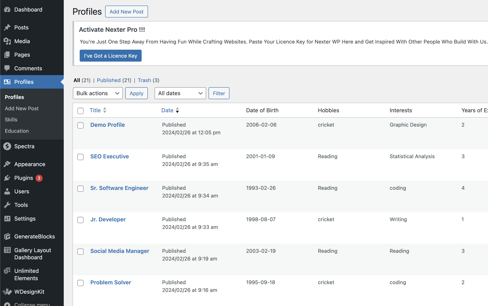
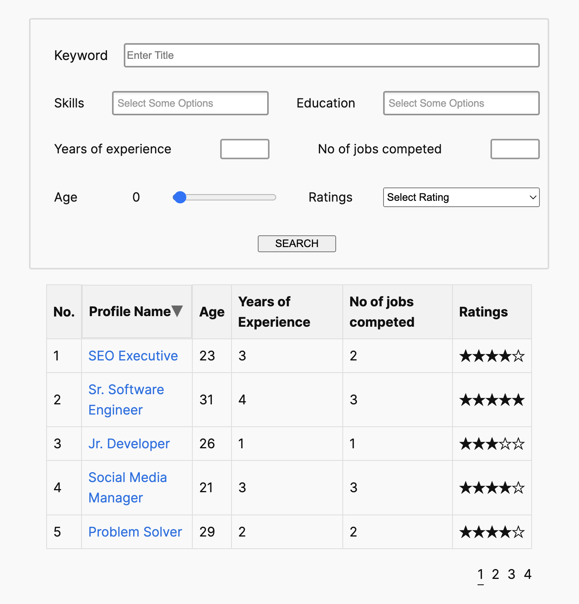
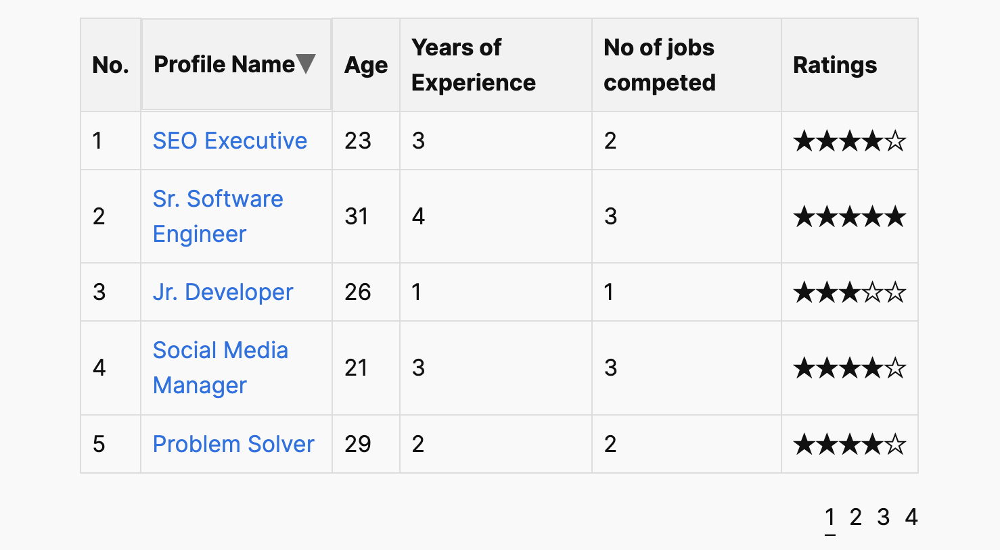

<h1 align="center" id="title">Profile Listing Table</h1>

<p align="center"></p>

<p align="center" id="description">This plugin display different profile Lists.</p>

<h2>🚀 Demo</h2>

[https://www.loom.com/share/c36a53b607bc4592a01f6968d21909dc](Video)

<h2>Project Screenshots:</h2>





  
<h2>🧐 Features</h2>

Here're some of the project's best features:

*   Add multiple profiles from admin dashboard
*   Filter all the profiles with different query at frontend
*   Add listing table anywhere with adding shortcode \['profile\_lists'\]
*   Arrange data in ascending and descending order in a table formate
*   Use pagination to load more data in a table

<h2>🛠️ Installation Steps:</h2>

<p>1. Download Plugin and extract file in your WordPress setup</p>

<p>2. Open terminal and go to your plugin path and hit the command</p>

```
composer install
```

<p>3. Find Profiles name post type and add some posts.</p>

<p>4. Create a new page and add shotcode [profile_lists] and preview the page.</p>

  
  
<h2>💻 Built with</h2>

Technologies used in the project:

*   PHP
*   javascript
*   html
*   css
